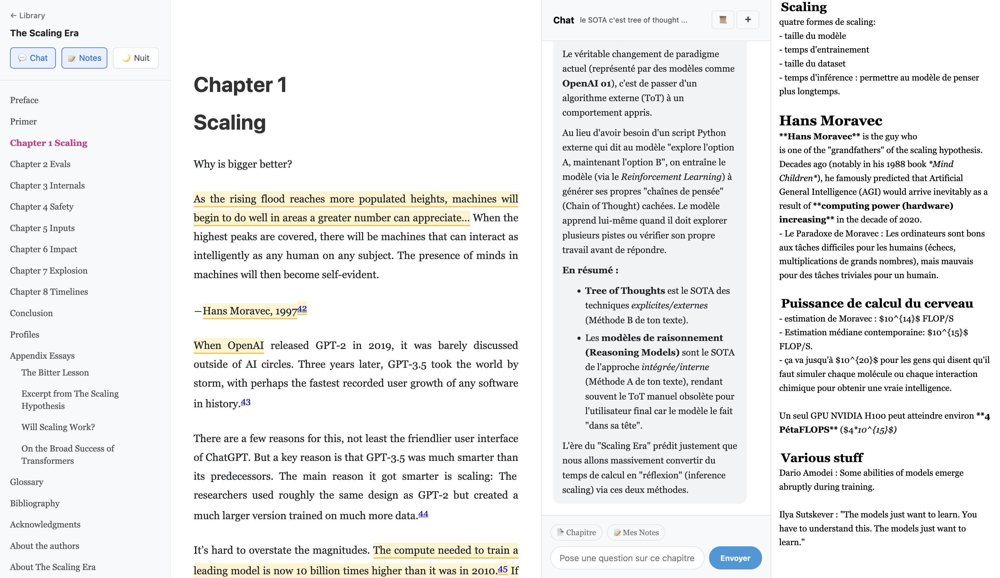

# Reader3

A comprehensive ebook reader application designed to enhance your reading experience on Mac by syncing with your Kobo e-reader and integrating with powerful productivity tools.

> **Note**: This project is forked from [Andrej Karpathy's reader](https://github.com/karpathy/reader3) and extended with additional features.

> ⚠️ **Current Status**: This project is in active development. In its current state, it may not work out-of-the-box on your local machine due to hardcoded paths and configuration. Improvements are planned to make setup and path configuration easier.

## What This Tool Does

Reader3 bridges the gap between your Kobo e-reader and your computer, offering a feature-rich reading environment with AI-powered conversations, note-taking, and Obsidian integration.

### Core Features

#### 📚 **Ebook Management**

- **Kobo Integration**: Automatically retrieves ebooks from your Kobo Desktop Edition library
- **DRM Handling**: Uses [kobo-book-downloader](https://github.com/TnS-hun/kobo-book-downloader) to download and decrypt your purchased books
- **Format Support**: Works with EPUB files and manages book metadata

#### ✨ **Highlights & Annotations**

- **Sync from Kobo**: Retrieves all your highlights and annotations from Kobo Desktop's SQLite database
- **In-App Highlighting**: Add new highlights directly in the reader interface
- **Persistent Storage**: Highlights are saved locally and persist across sessions
- **Easy Selection**: Simple text selection to highlight passages

#### 💬 **AI-Powered Chat**

- **Chapter Discussions**: Open conversations with an LLM about the chapter you're reading
- **Context-Aware**: Easily add the full chapter, specific passages, or your notes to the conversation
- **Chat History**: Access previous discussions organized by chapter
- **Streaming Responses**: Real-time streaming of LLM responses for better interactivity
- **Multiple Conversations**: Create new conversations for different topics within the same chapter

#### 📝 **Note-Taking with Obsidian Integration**

- **Bi-Directional Sync**: Notes sync automatically between Reader3 and your Obsidian vault
- **Structured Organization**:
  - Books stored in `books/Book_Title/` folders
  - Main book note (`Book_Title.md`) with chapter links
  - Individual chapter notes (`Chapter_Title.md`)
- **Auto-Save**: Changes in the reader are saved automatically
- **Live Updates**: Notes modified in Obsidian appear in the reader (2s polling)
- **Markdown Support**: Write notes in Markdown format
- **Vault Location**: `/path_to_vault/vault_name/books/`

#### 🌙 **User Interface**

- **Night Mode**: Dark theme for comfortable reading
- **Retractable Panels**: Collapsible side panels for notes and chat
- **Chapter Navigation**: Easy navigation through book table of contents
- **Clean Reading Experience**: Distraction-free interface focused on content

## Workflow

1. **Sync Your Kobo**: After reading on your Kobo device, sync it with Kobo Desktop Edition
2. **Import Books**: Use the integrated book downloader to retrieve your books with highlights
3. **Read & Annotate**: Read in the web interface, add highlights and select text
4. **Take Notes**: Open the notes panel to write chapter-specific notes in Markdown
5. **Discuss with AI**: Open the chat panel to have conversations about the content
6. **Integrate with Obsidian**: All notes are automatically synced to your Obsidian vault

## Technical Details

- **Backend**: Python-based Flask server
- **Frontend**: Web interface with real-time updates
- **Storage**: Local SQLite database for Kobo data, JSON for chat history
- **LLM Integration**: Streaming responses for chat functionality
- **File Management**: Modular path management with dedicated utilities

## Roadmap

- [ ] Markdown rendering like Obsidian
- [ ] Web search integration
- [ ] Document editing via langchain
- [ ] Code refactoring
- [ ] Enhanced note linking

## Setup

The application uses Kobo Desktop Edition for syncing books and highlights:

- Kobo data location: `/Users/username/Library/Application Support/Kobo/Kobo Desktop Edition`
- Books must be synced: Kobo device → Kobo Desktop → Reader3 interface
